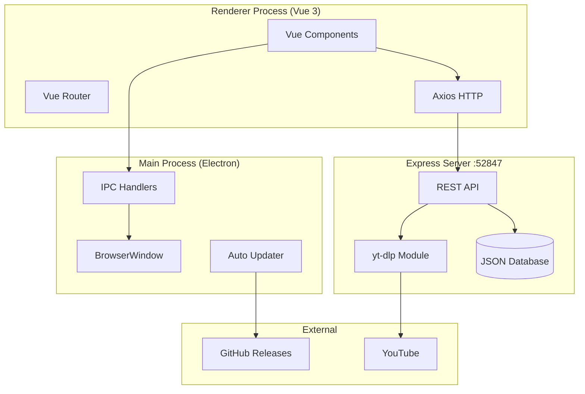
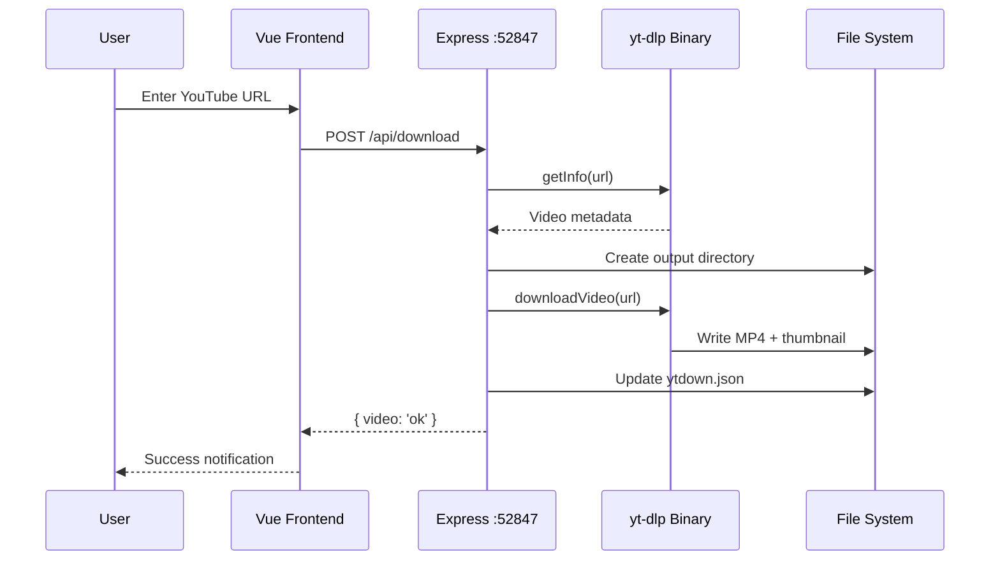
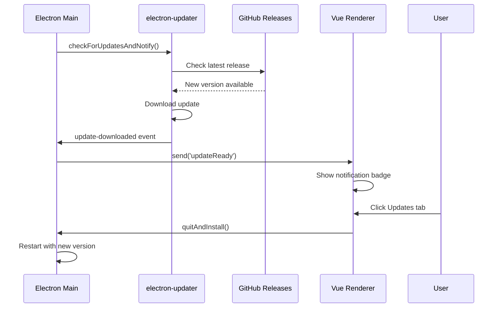

# QTube Codebase Map

> Auto-generated by Cartographer. A Quasar/Electron YouTube downloader with yt-dlp integration.

## System Overview



## Directory Structure

```
qtube/
├── src/                    # Vue frontend
│   ├── boot/              # App initialization (axios, i18n)
│   ├── components/        # Reusable Vue components
│   ├── layouts/           # Page layouts (navigation, controls)
│   ├── pages/             # Route views (download, videos, player)
│   ├── router/            # Vue Router configuration
│   └── store/             # Vuex store (unused)
├── src-electron/          # Electron main process
│   ├── electron-main.js   # Entry point, window, IPC
│   ├── electron-preload.js # Context bridge API
│   └── main-process/
│       └── server/        # Express backend
│           └── modules/   # yt-dlp, file utils
├── bin/                   # Bundled binaries (yt-dlp, ffmpeg)
├── docs/                  # GitHub Pages site
└── .github/workflows/     # CI/CD pipeline
```

## Module Guide

### Electron Main Process

| File | Purpose | Tokens |
|------|---------|--------|
| `src-electron/electron-main.js` | Window creation, IPC, auto-update | 1,389 |
| `src-electron/electron-preload.js` | Context bridge API | 430 |

**Key Responsibilities:**
- Creates frameless window in production
- Handles IPC for file system operations
- Manages auto-updates from GitHub releases
- Starts Express server on port 52847

**IPC API (`window.electronAPI`):**
- `closeApp()`, `minimize()`, `quitAndInstall()`
- `createYtDownFolder()`, `createVideosFolder()`, `createMusicFolder()`
- `createDatabaseFolder()`, `createFileDatabase()`, `getFolderApp()`
- `onUpdateReady(callback)`, `removeUpdateListener()`

### Express Backend

| File | Purpose | Tokens |
|------|---------|--------|
| `server/server.js` | REST API endpoints | 1,179 |
| `modules/ytdlp/index.js` | yt-dlp wrapper | 1,796 |
| `modules/manipulate-files/index.js` | File utilities | 47 |

**API Endpoints:**

| Method | Path | Purpose |
|--------|------|---------|
| POST | `/api/download` | Download video (MP4) |
| POST | `/api/download-mp3` | Download audio (MP3) |
| GET | `/api/infos` | List all downloads |

**Database:** `~/Downloads/Ytdown/database/ytdown.json`
```json
{
  "videos": [{ "title", "description", "thumbnail", "src" }],
  "musics": [{ "title", "description", "thumbnail", "src" }]
}
```

### Vue Frontend

| File | Purpose | Tokens |
|------|---------|--------|
| `layouts/default.vue` | Navigation tabs, window controls | 757 |
| `pages/index.vue` | Download form (URL input) | 895 |
| `pages/videos.vue` | Video grid view | 603 |
| `pages/musics.vue` | Music grid view | 605 |
| `pages/player.vue` | Media player wrapper | 230 |
| `components/videoPlayer.vue` | Video.js player | 700 |

**Routes:**
- `/index` - Download page (default)
- `/videos` - Downloaded videos grid
- `/musics` - Downloaded music grid
- `/player/:src/:img` - Media player

## Data Flow

### Download Flow



### Auto-Update Flow



## Conventions

### File Naming
- Vue components: `PascalCase.vue` for components, `kebab-case.vue` for pages
- JavaScript: ES modules (`import/export`)
- Electron: Main process uses `.js`, preload uses `.js`

### API Patterns
- IPC: `handle`/`invoke` for async operations
- REST: JSON request/response
- Database: Direct JSON file read/write

### Code Style
- Vue Options API (some Composition API in player)
- Quasar components (`q-*`)
- No TypeScript

## Gotchas

1. **Router Mode**: Must use `hash` mode for Electron's `file://` protocol
2. **IPC Mismatch**: Preload uses `invoke()`, main must use `handle()` (not `on`)
3. **Direct Import**: Never `import { ipcRenderer } from 'electron'` in renderer with `contextIsolation: true`
4. **Database Init**: JSON database may not exist on first run - handle gracefully
5. **Binary Paths**: yt-dlp/ffmpeg paths differ between dev (`cwd/bin`) and prod (`resourcesPath/bin`)
6. **Port Conflict**: Express runs on 52847 (avoid conflict with dev servers)
7. **Auto-Update**: Only works in production builds (not dev mode)
8. **Title Sanitization**: Special characters removed from video titles for file paths

## Navigation Guide

**To add a new download format:**
1. Add endpoint in `server/server.js`
2. Add yt-dlp command in `modules/ytdlp/index.js`
3. Add button/option in `pages/index.vue`

**To modify the player:**
1. Edit `components/videoPlayer.vue` (Video.js config)
2. Update props in `pages/player.vue`

**To change auto-update behavior:**
1. Edit `checkForUpdates()` in `electron-main.js`
2. Modify `onUpdateReady` handler in `layouts/default.vue`

**To add a new IPC handler:**
1. Add `ipcMain.handle('name', handler)` in `electron-main.js`
2. Expose in `contextBridge` in `electron-preload.js`
3. Call via `window.electronAPI.name()` in renderer

**To modify CI/CD:**
1. Edit `.github/workflows/release.yml`
2. Update `docs/index.template.html` for download page
