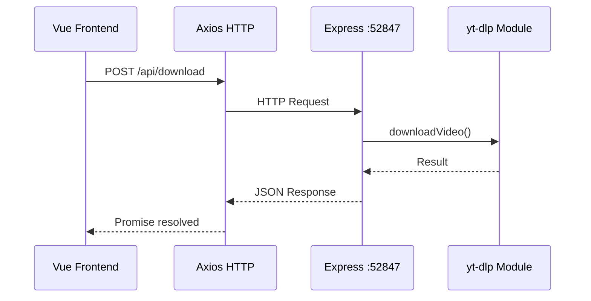
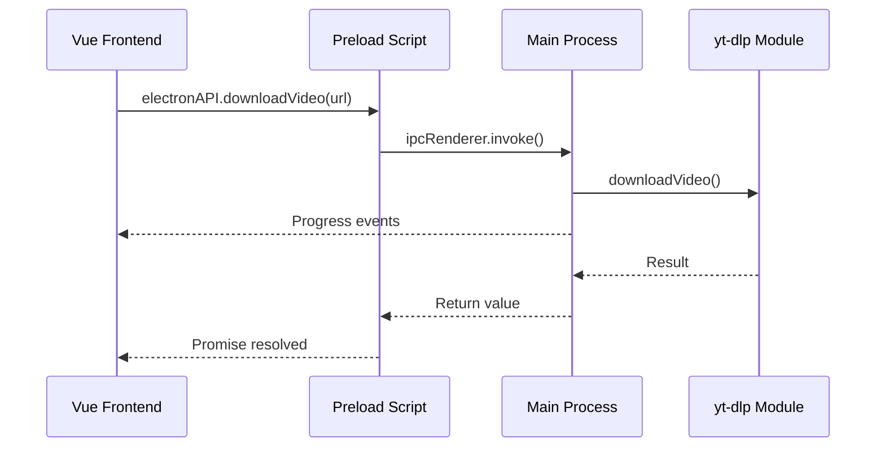

# Refactor: Express Server to IPC

> Implementation plan for migrating from embedded Express server to native Electron IPC.
> Related Issue: [#1](https://github.com/iagocavalcante/qtube/issues/1)

## Overview

QTube currently uses an embedded Express server on port 52847 to handle download requests. This document outlines the migration to native Electron IPC handlers for a cleaner, more secure architecture.

## Current vs Proposed Architecture

### Current Flow


### Proposed Flow


## Benefits

| Aspect | Express Server | IPC Handlers |
|--------|---------------|--------------|
| Port conflicts | Possible (52847) | None |
| Security | Localhost exposure | Process-isolated |
| Dependencies | express, cors, axios | Built-in |
| Progress updates | Polling or SSE | Native events |
| Error handling | HTTP status codes | Direct exceptions |
| Debugging | Network tab | DevTools IPC |

## Implementation Phases

### Phase 1: IPC Handler Setup

Add handlers to `electron-main.js`:

```javascript
const { downloadVideo, downloadMp3, getInfo } = require('./main-process/server/modules/ytdlp')
const { readDatabase, writeDatabase, ensureDatabaseExists } = require('./main-process/server/modules/database')

// Download video with progress
ipcMain.handle('downloadVideo', async (event, url) => {
  try {
    // Validate URL
    if (!url || !url.includes('youtube.com') && !url.includes('youtu.be')) {
      throw new Error('Invalid YouTube URL')
    }

    // Get video info first
    const info = await getInfo(url)

    // Send progress: starting
    event.sender.send('downloadProgress', {
      stage: 'downloading',
      title: info.title,
      percent: 0
    })

    // Download video
    const result = await downloadVideo(url, defaultPath, (progress) => {
      event.sender.send('downloadProgress', {
        stage: 'downloading',
        percent: progress
      })
    })

    // Update database
    const db = readDatabase(defaultPath)
    db.videos.push({
      title: info.title,
      description: info.description,
      thumbnail: result.thumbnail,
      src: result.path
    })
    writeDatabase(defaultPath, db)

    // Send complete
    event.sender.send('downloadProgress', {
      stage: 'complete',
      percent: 100
    })

    return { success: true, video: result }
  } catch (error) {
    event.sender.send('downloadProgress', {
      stage: 'error',
      error: error.message
    })
    throw error
  }
})

// Download audio (MP3)
ipcMain.handle('downloadAudio', async (event, url) => {
  // Similar implementation for audio
})

// Get all downloads
ipcMain.handle('getDownloads', async () => {
  const db = readDatabase(defaultPath)
  return db
})

// Get video info (for validation/preview)
ipcMain.handle('getVideoInfo', async (event, url) => {
  return await getInfo(url)
})
```

### Phase 2: Preload Script Updates

Update `electron-preload.js`:

```javascript
const { contextBridge, ipcRenderer } = require('electron')

contextBridge.exposeInMainWorld('electronAPI', {
  // Window controls (existing)
  closeApp: () => ipcRenderer.invoke('closeApp'),
  minimize: () => ipcRenderer.invoke('minimize'),
  quitAndInstall: () => ipcRenderer.invoke('quitAndInstall'),

  // Folder operations (existing)
  createYtDownFolder: () => ipcRenderer.invoke('createYtDownFolder'),
  createVideosFolder: () => ipcRenderer.invoke('createVideosFolder'),
  createMusicFolder: () => ipcRenderer.invoke('createMusicFolder'),
  createDatabaseFolder: () => ipcRenderer.invoke('createDatabaseFolder'),
  createFileDatabase: () => ipcRenderer.invoke('createFileDatabase'),
  getFolderApp: () => ipcRenderer.invoke('getFolderApp'),

  // Update (existing)
  onUpdateReady: (callback) => ipcRenderer.on('updateReady', (event, info) => callback(info)),
  removeUpdateListener: () => ipcRenderer.removeAllListeners('updateReady'),

  // NEW: Download API
  downloadVideo: (url) => ipcRenderer.invoke('downloadVideo', url),
  downloadAudio: (url) => ipcRenderer.invoke('downloadAudio', url),
  getDownloads: () => ipcRenderer.invoke('getDownloads'),
  getVideoInfo: (url) => ipcRenderer.invoke('getVideoInfo', url),

  // NEW: Progress events
  onDownloadProgress: (callback) => {
    ipcRenderer.on('downloadProgress', (event, progress) => callback(progress))
  },
  removeDownloadProgressListener: () => {
    ipcRenderer.removeAllListeners('downloadProgress')
  }
})
```

### Phase 3: Vue Frontend Updates

Update `src/pages/index.vue`:

```javascript
// Before (axios)
async downloadVideo() {
  await axios.post('http://localhost:52847/api/download', { url: this.url })
}

// After (IPC)
async downloadVideo() {
  // Set up progress listener
  window.electronAPI.onDownloadProgress((progress) => {
    this.downloadProgress = progress.percent
    this.downloadStage = progress.stage
  })

  try {
    await window.electronAPI.downloadVideo(this.url)
    this.$q.notify({ type: 'positive', message: 'Download complete!' })
  } catch (error) {
    this.$q.notify({ type: 'negative', message: error.message })
  } finally {
    window.electronAPI.removeDownloadProgressListener()
  }
}
```

Update `src/pages/videos.vue` and `src/pages/musics.vue`:

```javascript
// Before (axios)
async created() {
  const { data } = await axios.get('http://localhost:52847/api/infos')
  this.videos = data.videos
}

// After (IPC)
async created() {
  const data = await window.electronAPI.getDownloads()
  this.videos = data.videos
}
```

### Phase 4: Database Module Extraction

Create `src-electron/main-process/modules/database.js`:

```javascript
const fs = require('fs')
const path = require('path')

function getDefaultDatabase() {
  return { videos: [], musics: [] }
}

function ensureDatabaseExists(basePath) {
  const dbDir = path.join(basePath, 'database')
  const dbPath = path.join(dbDir, 'ytdown.json')

  if (!fs.existsSync(dbDir)) {
    fs.mkdirSync(dbDir, { recursive: true })
  }

  if (!fs.existsSync(dbPath)) {
    fs.writeFileSync(dbPath, JSON.stringify(getDefaultDatabase(), null, 2))
  }

  return dbPath
}

function readDatabase(basePath) {
  const dbPath = ensureDatabaseExists(basePath)
  try {
    const content = fs.readFileSync(dbPath, 'utf-8')
    return content ? JSON.parse(content) : getDefaultDatabase()
  } catch {
    return getDefaultDatabase()
  }
}

function writeDatabase(basePath, data) {
  const dbPath = ensureDatabaseExists(basePath)
  fs.writeFileSync(dbPath, JSON.stringify(data, null, 2))
}

module.exports = {
  getDefaultDatabase,
  ensureDatabaseExists,
  readDatabase,
  writeDatabase
}
```

### Phase 5: Cleanup

Files to remove after migration is complete and tested:
- `src-electron/main-process/server/server.js`
- `src/boot/axios.js` (or simplify if used elsewhere)

Dependencies to remove from `package.json`:
- `express` (if not used elsewhere)
- `cors` (if not used elsewhere)

## Testing Checklist

- [ ] Download video works via IPC
- [ ] Download audio works via IPC
- [ ] Progress updates display correctly
- [ ] Error handling works (invalid URL, network error)
- [ ] Videos page loads downloads list
- [ ] Musics page loads downloads list
- [ ] Database updates correctly
- [ ] Works on macOS
- [ ] Works on Windows
- [ ] Works on Linux
- [ ] No console errors
- [ ] Auto-updater still works

## Rollback Plan

If issues arise:
1. Keep server.js in codebase during transition
2. Add feature flag: `USE_IPC_DOWNLOADS=true`
3. Can switch back to Express by changing flag
4. Remove server only after 1-2 stable releases

## Timeline

| Phase | Description | Estimated Effort |
|-------|-------------|------------------|
| 1 | IPC Handlers | Core implementation |
| 2 | Preload Script | API exposure |
| 3 | Vue Frontend | UI updates |
| 4 | Database Module | Code extraction |
| 5 | Cleanup | Remove old code |
| 6 | Testing | All platforms |

## References

- [Electron IPC Documentation](https://www.electronjs.org/docs/latest/tutorial/ipc)
- [Context Isolation](https://www.electronjs.org/docs/latest/tutorial/context-isolation)
- [Issue #1](https://github.com/iagocavalcante/qtube/issues/1)
